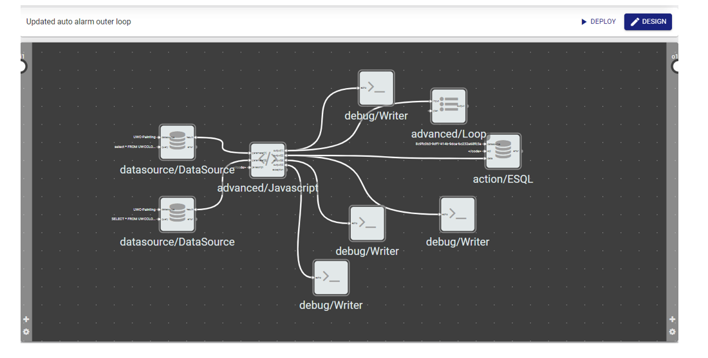

# Temperature-Monitoring-Using-V-ONE
The code will check for any changes in the machine temperature by comparing the current and previous value of the data and triggering a E-Ticket if an abnormal temperature has been detected using V-ONE by utilizing 2 workflow called inner and outer loop.

# Outer Loop

The outer loop can be split into 5 parts to summarize its functionality

# Outer Loop Part 1
The first part will declare 6 arrays and assign 2 arrays to store the data source and declare a variable with 0 as its value to store the time format later. 

# Outer Loop Part 2
The second part will loop through the array storing the data source of the current and assign the timestamp into the variable declared earlier and get the substring of it in order to eliminate the T and Z from the timestamp value to prevent ESQL error. The Name, Status and variable will then be pushed into an array called arr1.

# Outer Loop Part 3
Part 3 will perform the same logic for the data source that contains the previous data by pushing the data into an array called arr2.

# Outer Loop Part 4
Part 4 will use a nested loop to check if the current value is different from the previous value and assign the current value into an array called finarr if the nested loop fulfils the following requirement:

-If the current Name matches the previous Name
-If the current value doesn’t match with the previous value
-If the current timestamp doesn’t match with the previous timestamp
-If the current value is 1 
-If the previous value is 0

# Outer Loop Part 5
Part 4 will push the data into the ESQL and Loop component to update the current data in the database and send out email for each item in the array 

# Inner Loop

The inner loop will extract the data passed from the outer loop using the wall component and send out an email depending on the specified data. The wall component has none declared so in case when there is no abnormality, no email will be sent out. 
